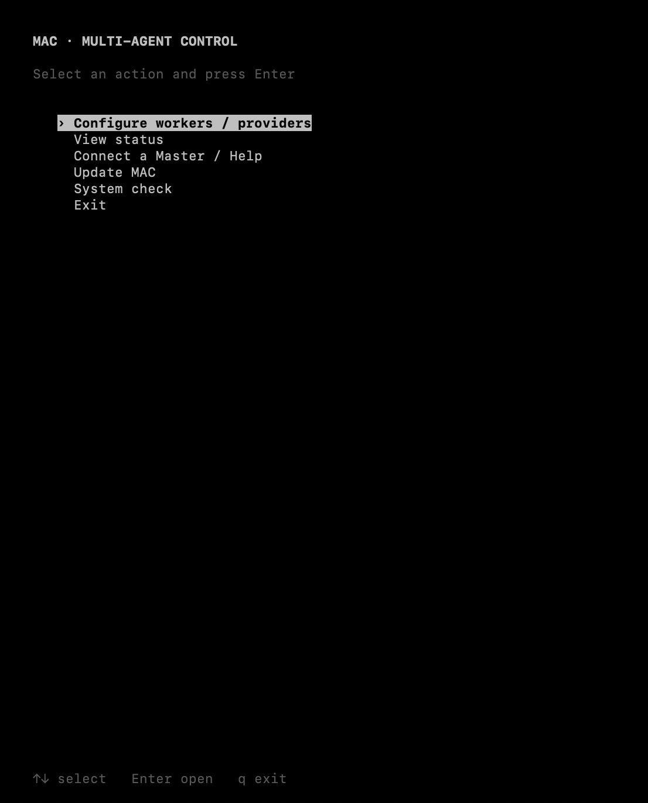
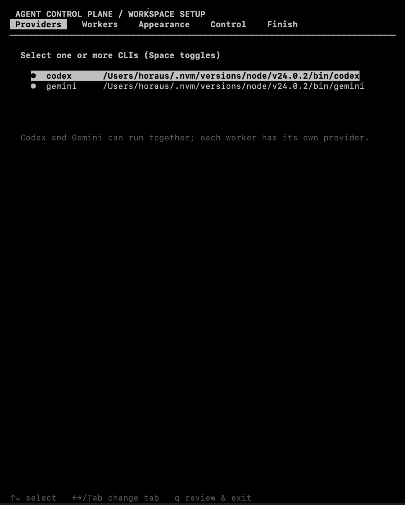
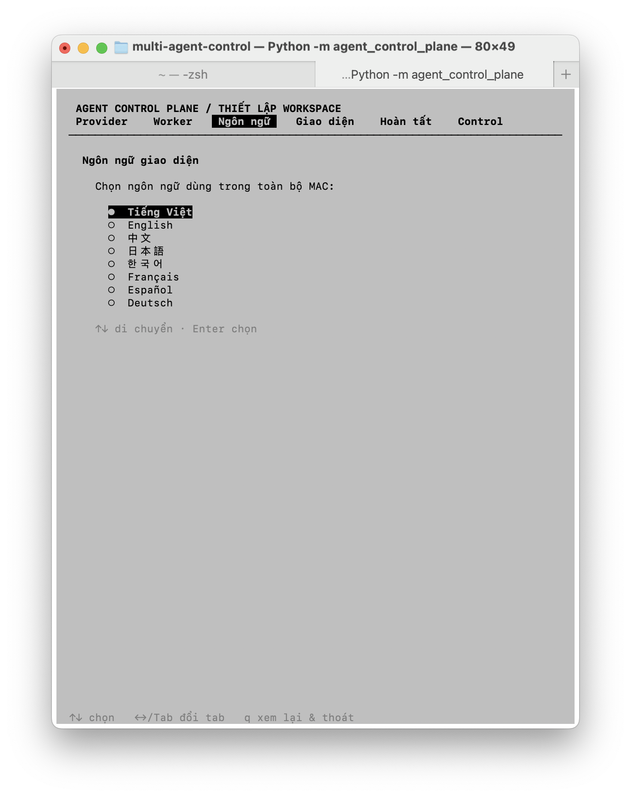
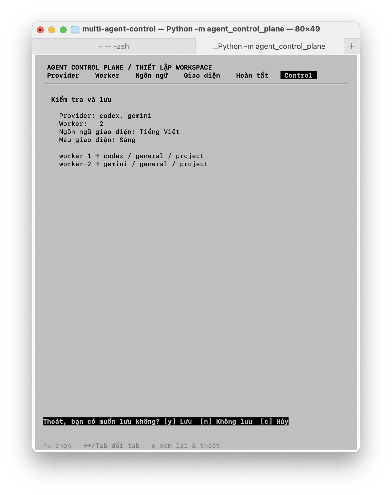

# Multi-Agent Control (MAC)

MAC is a local MCP control plane that lets an AI Master coordinate configurable
workers. It manages worker capacity, task state, validation and approval while
keeping the Master in control.

## English

### Install

```bash
git clone https://github.com/Horaus/mac.git
cd mac
./scripts/bootstrap.sh .
```

After installation, run `mac` from any terminal. The first run opens setup;
later runs use the same command and preserve configuration and runtime data.

### Connect an AI host

MAC is called through MCP. After installing and configuring it in Codex, Claude,
Gemini or another MCP-compatible host, write only:

```text
Connect to MAC installed from Horaus/mac through MCP.
```

After connecting, MAC loads its rules and knowledge; the Master asks for the
goal, worker count and expected result. The AI host must show MAC tools before
it can call MAC. A prompt alone cannot connect an unconfigured local process.

### Update

```bash
cd mac
git pull
./scripts/bootstrap.sh .
```

The setup and state directory is kept outside the checkout, so updates do not
overwrite the saved profile.

### First setup screen



From the main menu you can open setup, status, Master help, update and system
check. The same menu is available every time you run `mac`.



Select one or more CLI providers. Different workers can use different
providers; Codex and Gemini can run in the same profile.



Choose providers, configure workers, set the interface language/theme, and
select the worker policy. Your saved profile is kept outside the repository.

### Control confirmation



Review the selected providers, worker count, policy and appearance before
saving. Use `q` to review the Finish page, then choose save, discard or cancel.

## Tiếng Việt

### Cài đặt

```bash
git clone https://github.com/Horaus/mac.git
cd mac
./scripts/bootstrap.sh .
```

Sau khi cài đặt, chạy `mac` từ bất kỳ Terminal nào. Lần đầu MAC mở màn hình
thiết lập. Những lần sau vẫn chỉ cần dùng lệnh `mac`; cấu hình và dữ liệu chạy
được giữ nguyên khi cập nhật.

### Kết nối ứng dụng AI

MAC được gọi thông qua MCP. Sau khi cài và cấu hình MAC với Codex, Claude,
Gemini hoặc host hỗ trợ MCP khác, chỉ cần nhập:

```text
Kết nối tới MAC đã cài đặt từ Horaus/mac qua MCP.
```

Sau khi kết nối, MAC tự nạp rule và knowledge; Master sẽ hỏi tiếp mục tiêu,
số worker và kết quả cần đạt. Ứng dụng AI phải hiển thị MAC tool trước khi gọi
được MAC; chỉ nhập prompt không thể tự kết nối process nếu MCP chưa cấu hình.

### Cập nhật

```bash
cd mac
git pull
./scripts/bootstrap.sh .
```

Thư mục cấu hình và dữ liệu được lưu ngoài checkout, vì vậy cập nhật source
không ghi đè profile đã lưu.

### Hình ảnh giao diện


Từ menu chính, bạn có thể mở thiết lập, xem trạng thái, đọc hướng dẫn Master,
cập nhật và kiểm tra hệ thống.


Bạn có thể chọn một hoặc nhiều provider. Mỗi worker có thể dùng provider khác
nhau; Codex và Gemini có thể chạy chung trong một profile.


Bạn có thể chọn provider, số worker, ngôn ngữ, màu giao diện và chính sách
worker trong một luồng thiết lập duy nhất.


Trước khi lưu, MAC hiển thị lại provider, số worker, chính sách và giao diện
để bạn kiểm tra. Nhấn `q` để xem trang Hoàn tất, sau đó chọn lưu, bỏ thay đổi
hoặc hủy.

## Documentation / Tài liệu

- `docs/usage/quickstart.md`: first setup / thiết lập lần đầu.
- `docs/integrations/master-chat.md`: MCP connection / kết nối MCP.
- `docs/usage/safety-and-permissions.md`: permissions / quyền truy cập.
