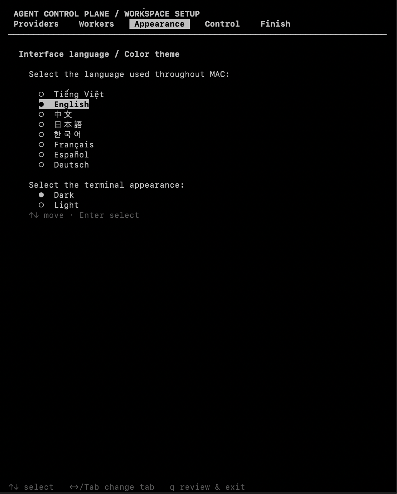

# Multi-Agent Control (MAC)

MAC connects an AI Master to local workers through MCP.

- [Tiếng Việt](#tiếng-việt)
- [English](#english)

## Tiếng Việt

### Dành cho người dùng

#### 1. Cài đặt lần đầu

Chạy ba lệnh sau trong Terminal:

    git clone https://github.com/Horaus/mac.git
    cd mac
    ./scripts/bootstrap.sh .

Sau khi cài đặt, mở MAC từ bất kỳ Terminal nào bằng:

    mac

Lần đầu MAC mở màn hình thiết lập. Những lần sau vẫn dùng lệnh
<code>mac</code>; profile và dữ liệu được giữ nguyên khi cập nhật.

#### 2. Kết nối với ứng dụng AI

Mở thư mục project <code>mac</code> trong Codex, Claude, Gemini hoặc ứng dụng AI
có hỗ trợ MCP. Sau đó gửi cho AI đúng một câu:

    Đọc README của project này và kết nối tới MAC MCP server đã cài đặt.

Phần còn lại dành cho AI agent ở ngay bên dưới. Người dùng không cần tự chép
các lệnh MCP dài.

#### 3. Cập nhật

    cd mac
    git pull
    ./scripts/bootstrap.sh .

### Dành cho AI agent

Đây là hướng dẫn để AI agent tự thiết lập kết nối, không phải các bước người
dùng phải nhập thủ công.

1. Xác định thư mục gốc MAC đang mở và dùng đường dẫn tuyệt đối.
2. Chọn cấu hình tương ứng với host hiện tại.
3. Khởi động lại host nếu cấu hình MCP yêu cầu.
4. Xác nhận MAC tools đã xuất hiện và gọi <code>control_status</code>.
5. Nạp rule/knowledge MAC cung cấp, rồi hỏi người dùng mục tiêu, số worker và
   kết quả cần đạt.

#### Codex CLI, Codex app hoặc extension

Từ thư mục gốc MAC:

    codex mcp add mac --env PYTHONPATH="$PWD/src" -- "$PWD/.venv/bin/python" -m agent_control_plane mcp --state "$PWD/.agent-control-plane/state.sqlite3"
    codex mcp get mac

Codex app và extension dùng cùng cấu hình MCP. Nếu tool chưa xuất hiện, khởi
động lại Codex rồi gọi <code>control_status</code>.

#### Claude Code

    claude mcp add --scope user mac --env PYTHONPATH="$PWD/src" -- "$PWD/.venv/bin/python" -m agent_control_plane mcp --state "$PWD/.agent-control-plane/state.sqlite3"
    claude mcp get mac

Khởi động lại Claude Code, kiểm tra bằng <code>/mcp</code>, rồi gọi
<code>control_status</code>.

#### Gemini CLI

Thêm server <code>mac</code> vào <code>~/.gemini/settings.json</code>, thay
<code>/ABSOLUTE/PATH/mac</code> bằng đường dẫn tuyệt đối của project:

    {
      "mcpServers": {
        "mac": {
          "command": "/ABSOLUTE/PATH/mac/.venv/bin/python",
          "args": ["-m", "agent_control_plane", "mcp", "--state", "/ABSOLUTE/PATH/mac/.agent-control-plane/state.sqlite3"],
          "env": {"PYTHONPATH": "/ABSOLUTE/PATH/mac/src"}
        }
      }
    }

Khởi động lại Gemini, xác nhận MAC tools xuất hiện, rồi gọi
<code>control_status</code>.

## English

### For users

#### 1. First installation

    git clone https://github.com/Horaus/mac.git
    cd mac
    ./scripts/bootstrap.sh .

Open MAC later from any terminal with:

    mac

#### 2. Connect an AI application

Open the <code>mac</code> project in Codex, Claude, Gemini, or another
MCP-compatible AI host. Send the AI this single sentence:

    Read this project's README and connect to the installed MAC MCP server.

The AI-specific setup is below; users do not need to copy the long MCP
commands manually.

#### 3. Update

    cd mac
    git pull
    ./scripts/bootstrap.sh .

### For AI agents

1. Resolve the absolute MAC project path.
2. Configure the current host using the matching command above.
3. Restart the host when required.
4. Verify that MAC tools are visible and call <code>control_status</code>.
5. Load the rules and knowledge supplied by MAC, then ask the user for the
   goal, worker count, and expected result.

## Interface preview

  
  
  

The screenshots are references only; language, colors, providers, and workers
depend on the saved profile.

## More documentation

- <code>docs/usage/quickstart.md</code>
- <code>docs/integrations/master-chat.md</code>
- <code>docs/usage/safety-and-permissions.md</code>
